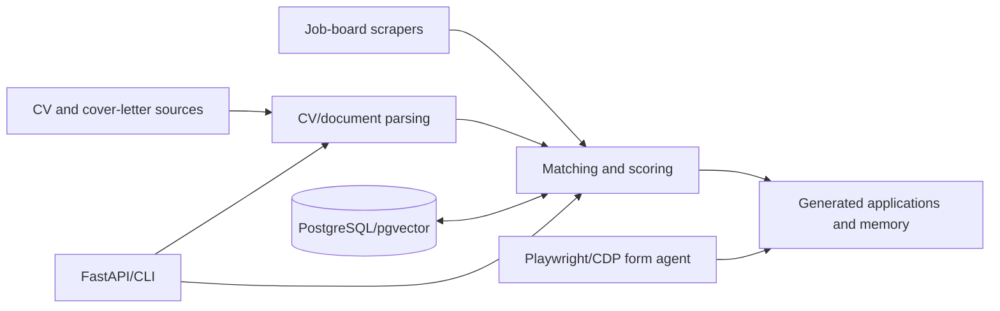

# JobPredator

AI-assisted job discovery and application tooling: CV parsing, job scraping, semantic matching, document generation, and browser-assisted form filling.

## Quick start

```powershell
git clone https://github.com/alinik24/job_predator.git
cd job_predator
.\bootstrap.ps1
.\.venv\Scripts\python.exe scripts\doctor.py
.\.venv\Scripts\python.exe main.py --help
```

POSIX: `./bootstrap.sh`, then `.venv/bin/python main.py --help`.

The bootstrap creates `.venv`, installs the committed dependency contract, installs Chromium for Playwright, and runs the doctor. It is safe to rerun.

## Configuration

Secrets are never committed. Bootstrap and runtime may read configuration from:

- environment variables;
- `%USERPROFILE%\.config\job_predator\.env` on Windows;
- `$XDG_CONFIG_HOME/job_predator/.env` or `~/.config/job_predator/.env` on POSIX;
- a repository `.env` only for local development.

Important names include `LLM_API_KEY`, `LLM_API_BASE_URL`, `LLM_MODEL_NAME`, `DATABASE_URL`, `DATABASE_URL_SYNC`, and optional provider/platform credentials from `.env.example`. Values are never printed by the doctor.

## Architecture



See `docs/ARCHITECTURE.md` and `docs/DEVELOPMENT.md`.

## Development commands

```powershell
.\.venv\Scripts\python.exe scripts\doctor.py
.\.venv\Scripts\python.exe -m pytest -q
.\.venv\Scripts\python.exe main.py --help
```

Optional services:

```powershell
docker compose up -d
.\.venv\Scripts\python.exe init_db.py
```

Do not run application submission automatically. Human review remains required.

## Data and local state

`user_documents/`, `output/`, `memory/`, `.env`, virtual environments, caches, and downloaded models are local or generated state and are ignored by Git. Keep private credentials and machine paths in the external config directory; keep source and safe examples in Git.

## Verification

A healthy clone has a successful bootstrap, `doctor=PASS`, a passing applicable pytest suite, and `main.py --help` output. Database-backed workflows additionally require the local Compose services.
