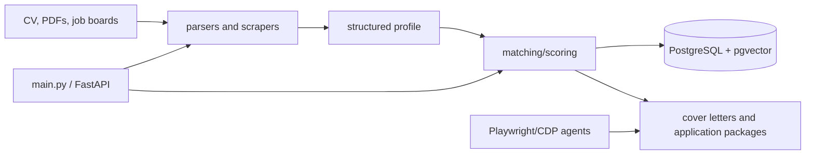

# Architecture

JobPredator is a Python CLI/API application with four main flows:

1. CV and document parsing produce structured profile material.
2. Job-board scrapers collect postings.
3. Matching/scoring combines profile data, semantic embeddings, and optional LLM reasoning.
4. CLI/API and browser agents generate or review application actions.

PostgreSQL/pgvector is an optional local service for persistence and vector search. `user_documents/`, `output/`, and `memory/` are local state, not source code.

